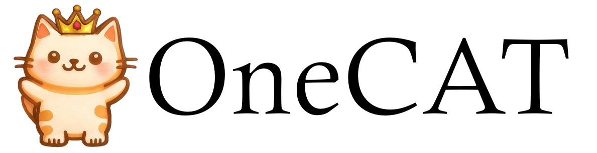

# OneCAT: Decoder-Only Auto-Regressive Model for Unified Understanding and Generation

<div align="center">
  
</div>
<hr>

<div align="center" style="line-height: 1;">
  <a href="https://arxiv.org/abs/2509.03498" target="_blank" style="margin: 2px;">
    
  </a>
  <a href="https://huggingface.co/onecat-ai/OneCAT-3B" target="_blank" style="margin: 2px;">
    
  </a>
  <a href="https://onecat-ai.github.io/" target="_blank" style="margin: 2px;">
    
  </a>
</div>


## Brief Introduction
We introduce OneCAT, a unified multimodal model that seamlessly integrates understanding, generation, and editing within a novel, pure decoder-only transformer architecture. Our framework uniquely eliminates the need for external components such as Vision Transformers (ViT) or vision tokenizer during inference, leading to significant efficiency gains, especially for high-resolution
inputs. This is achieved through a modality-specific Mixture-of-Experts (MoE) structure trained with a single autoregressive (AR) objective, which also natively supports dynamic resolutions. Furthermore, we pioneer a multi-scale visual autoregressive mechanism within the Large Language Model (LLM) that drastically reduces decoding steps compared to diffusion-based methods while maintaining state-of-the-art performance. Our findings demonstrate the powerful potential of pure autoregressive modeling as a sufficient and elegant foundation for unified multimodal intelligence. As a result, OneCAT sets a new performance standard, outperforming existing open-source unified multimodal models across benchmarks for multimodal generation, editing, and understanding.

### Key Features

#### 🌟 Pure Decoder-Only Design

Eliminates external vision encoders and VAE tokenizers during inference, using only a lightweight patch embedding layer for raw image processing.


#### 🌟 Mixture-of-Experts (MoE)

Three specialized FFN experts: Text FFN for language comprehension, Understanding FFN for visual tokens, and Generation FFN for image synthesis.

#### 🌟 Multi-Scale Autoregressive
Pioneer Next Scale Prediction paradigm that generates images coarse-to-fine, drastically reducing generation steps compared to diffusion models.

For more details, please refer to the [***OneCAT Technical Report***](https://arxiv.org/abs/2509.03498).


## Getting Started

### Installation

- Install 64-bit Python 3.11.8 and PyTorch 2.5.1 ([PyTorch installation guide](https://pytorch.org))
- Install Python libraries with:  
  ```bash
  pip3 install -r requirements.txt
  ```
- Download the [OneCAT-3B model](https://huggingface.co/onecat-ai/OneCAT-3B)
- Download the Infinity Tokenizer [infinity_vae_d32reg.pth](https://huggingface.co/FoundationVision/Infinity/resolve/main/infinity_vae_d32reg.pth?download=true) 


### Visual Understanding

```bash
accelerate launch --num_processes=1 generate_understanding.py \
    --model_name_or_path="path/to/OneCAT-3B" \
    --img_path="assets/chat.png" \
    --question="What is d in the last equation?" \
```

### Text-to-Image Generation

```bash
accelerate launch --num_processes=1 generate_txt2img.py \
    --model_name_or_path="path/to/OneCAT-3B" \
    --vae_path="path/to/infinity_vae_d32reg.pth" \
    --prompt="a photo of a bench" \
    --output_dir="output/txt2img" \
```

### Image Editing

```bash
accelerate launch --num_processes=1 generate_imgedit.py \
    --model_name_or_path="path/to/OneCAT-3B" \
    --vae_path="path/to/infinity_vae_d32reg.pth" \
    --image_path="assets/imgedit.png" \
    --prompt="Replace the bird in the image with a small rabbit." \
    --output_dir="output/imgedit" \
```


## Contact
If you have any questions, you can either create issues or contact us by email wangyaoming03@meituan.com


## ✍️ Citation

```bibtex
@article{Li2025OneCAT,
  title   = {OneCAT: Decoder-Only Auto-Regressive Model for Unified Understanding and Generation},
  author  = {Han Li, Xinyu Peng, Yaoming Wang, Zelin Peng, Xin Chen, Rongxiang Weng, Jingang Wang, Xunliang Cai, Wenrui Dai, Hongkai Xiong},
  journal = {arXiv preprint arXiv:2509.03498},
  year    = {2025}
}
```

## 📜 License
OneCAT is licensed under the Apache 2.0.

## Acknowledgments

This work builds upon the following great open-source projects:
- **Mono-InternVL** (https://github.com/OpenGVLab/Mono-InternVL)
- **Infinity** (https://github.com/FoundationVision/Infinity)
- **Qwen** (https://github.com/QwenLM/Qwen3)
